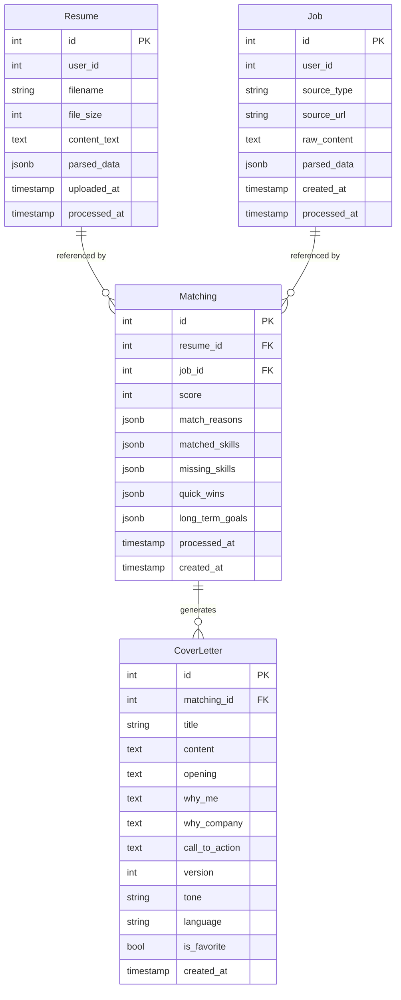

# Job Assistant

使用 **FastAPI、SQLAlchemy、PostgreSQL、Google Gemini、Instructor 與 Docker** 打造的 AI 求職助手。

將履歷解析、職缺解析、Resume × Job AI Matching 與 Cover Letter 生成整合為完整的 AI workflow，展示 **LLM Structured Output、Async Backend、Prompt Engineering 與 Production-style Deployment** 的實作能力。

🌐 **Live Demo**：https://job.tzuhan.dev
📖 **API Docs**：https://job.tzuhan.dev/docs

---

## Demo 展示

完整操作流程包含：

* 履歷解析
* JD 解析
* Resume × Job AI Matching
* Cover Letter Generation

https://github.com/user-attachments/assets/1635c49d-e056-484c-a387-3dcb97085493

### 1. 履歷解析

上傳 PDF 履歷後：

```text
PDF
 ↓
Text Extraction
 ↓
Gemini
 ↓
Structured Pydantic Output
 ↓
Database
```

使用 `pypdf` 取得文字內容，再透過 **Gemini + Instructor** 將非結構化履歷轉換為結構化資料。

解析內容包含：

* Basic information
* Education
* Work experience
* Skills
* Summary

LLM 解析失敗時仍保留原始履歷內容，並以 `processed_at = NULL` 標記未完成處理，讓後續可以重新處理。

---

### 2. JD 解析

支援兩種職缺輸入方式。

**URL**

```text
JD URL
 ↓
Firecrawl
 ↓
Raw Content
 ↓
Gemini
 ↓
Structured Data
```

**Text**

```text
JD Text
 ↓
Gemini
 ↓
Structured Data
```

Text endpoint 作為 URL scraping 失敗時的 fallback，讓使用者仍能處理反爬較嚴格的職缺網站。

---

### 3. Resume × Job AI Matching

選擇履歷與職缺後，由 Gemini 進行匹配分析。

分析結果包含：

* Match Score
* Matched Skills
* Missing Skills
* Match Reasons
* Quick Wins
* Long-term Goals

使用 Pydantic schema 約束 LLM output，並透過 rubric 與 prompt 設計降低輸出結果的不穩定性。

---

### 4. Cover Letter Generation

根據 Resume × Job Matching 結果生成客製化 Cover Letter。

支援：

* Professional
* Casual
* Formal
* Enthusiastic

以及：

* 繁體中文
* English

每次生成會建立新的 version，方便比較不同版本的內容。

---

# 技術亮點

## 1. LLM 結構化輸出

使用：

**Gemini + Instructor + Pydantic v2**

將 LLM output 限制在定義好的 Pydantic schema 中，避免直接依賴自由格式文字。

例如 Matching 結果會被轉換為：

```text
score
match_reasons
matched_skills
missing_skills
quick_wins
long_term_goals
```

讓 LLM output 可以直接進入後端 business logic 與 PostgreSQL。

---

## 2. 非同步後端架構

Backend 使用：

* FastAPI async
* SQLAlchemy 2.x async
* asyncpg

資料庫操作採 async session，並使用 `selectinload` 處理 relationship loading。

在 Cover Letter API 中，透過 eager loading 將需要的 Resume / Job 資料一次載入，避免不必要的 relationship queries。

---

## 3. 將 Matching 設計為 Domain Entity

Resume 與 Job 並不是單純的 many-to-many relationship。

`Matching` 本身承載：

* score
* matched skills
* missing skills
* match reasons
* quick wins
* long-term goals

因此將 Matching 設計為獨立的 **domain entity**，而不是單純的 junction table：

```text
Resume
   │
   ├── Matching ── Job
   │      │
   │      └── CoverLetter
   │
```

`Matching` 不僅保存 Resume 與 Job 的關聯，也承載兩者之間的 AI analysis 結果，讓後續 Cover Letter generation、歷史版本與分析結果都可以建立在同一個 matching context 上。

---

## 4. LLM 失敗處理

LLM application 不假設每次 request 都會成功。

履歷與 JD parsing 採用 partial-save pattern：

```text
Save raw content
      ↓
LLM processing
      ↓
Success → parsed_data + processed_at
Failure → raw content preserved
```

因此即使 LLM processing 失敗，原始資料仍然保留，可以重新處理，而不需要重新上傳。

---

## 5. 例外處理

建立三層 exception handling：

```text
Endpoint try/except
        ↓
FastAPI HTTPException / Validation Error
        ↓
Global Exception Handler
```

Global exception handler 用於處理 dependency layer 等 endpoint `try/except` 無法捕捉的錯誤，統一回傳 JSON error response，避免 production environment 直接暴露內部 exception。

---

## 6. 成本導向的 Rate Limiting

使用 `slowapi` 根據不同 endpoint 的 LLM 使用成本設定不同 rate limit：

```text
GET endpoints
100 / min

POST /matchings/score
30 / hour

POST /cover-letters/generate
20 / hour
```

根據不同 endpoint 的 LLM 使用成本設定 rate limit，降低高成本操作被大量呼叫的風險。

---

## 7. 安全性考量

### XSS 防護

LLM 解析結果與 user-controlled content 都視為 untrusted content。

Frontend render 前統一透過：

```text
escapeHtml()
```

處理字串，避免未經處理的內容直接插入 HTML。

### 通用錯誤回應

Production environment 不直接回傳：

```text
str(exception)
```

避免將 database、dependency 或 infrastructure details 暴露給 client。

---

## 8. Multi-stage Docker Build

使用 Docker multi-stage build：

```text
Builder
  ↓
Install dependencies
  ↓
Build wheels
  ↓
Runtime image
```

Production container：

* 使用 non-root `appuser`
* 不包含 build tools
* 僅複製必要 runtime dependencies
* Image 約 200MB

---

# 技術棧

## 後端

* Python 3.12
* FastAPI
* Pydantic v2
* SQLAlchemy 2.x Async
* asyncpg
* PostgreSQL 18
* Alembic
* pypdf

## AI / LLM

* Google Gemini 2.5 Flash
* Instructor
* Pydantic Structured Output
* Firecrawl

## 前端

* Vanilla JavaScript
* Tailwind CSS
* HTML5
* CSS3

## 安全性 / 後端基礎設施

* slowapi
* XSS escaping
* Global exception handling

## DevOps / Cloud

* Docker
* Docker Compose
* Render
* Cloudflare
* GitHub

---

# 系統架構

```text
                    ┌──────────────────┐
                    │     Frontend     │
                    │ Vanilla JS + UI  │
                    └────────┬─────────┘
                             │
                             ▼
                    ┌──────────────────┐
                    │     FastAPI      │
                    │   Async API      │
                    └────────┬─────────┘
                             │
             ┌───────────────┼────────────────┐
             ▼               ▼                ▼
       ┌───────────┐   ┌────────────┐   ┌────────────┐
       │ PostgreSQL│   │   Gemini   │   │ Firecrawl  │
       │           │   │ Instructor │   │            │
       └───────────┘   └────────────┘   └────────────┘
```

---

# 資料庫設計



### Schema 設計考量

* `Matching` 作為 domain entity，保存 Resume × Job 的 AI analysis。
* 使用 JSONB 保存 LLM structured output，保留 schema evolution 彈性。
* Resume / Job parsing 支援 raw content 與 parsed data 分離。
* 使用 FK cascade 維持 Resume → Matching → CoverLetter 的資料一致性。
* Cover Letter 支援以 version 管理不同生成結果。

---

# 部署架構

目前部署於 Render：

```text
GitHub
   │
   │ push / merge
   ▼
Render Auto Deploy
   │
   ├── Docker Build
   │
   ├── Alembic Migration
   │
   └── Uvicorn
          │
          ▼
     FastAPI Application
          │
          ├── PostgreSQL
          ├── Gemini API
          └── Firecrawl API
```

Production environment variables 透過 Render Secrets 管理：

```text
DATABASE_URL
GEMINI_API_KEY
FIRECRAWL_API_KEY
```

Custom domain：

```text
job.tzuhan.dev
        ↓
Cloudflare DNS
        ↓
Render
```

---

# 測試與 Production Validation

Automated integration testing 目前列為 v2 roadmap。

現階段透過 realistic API testing 與 failure simulation 驗證 production flow：

```bash
curl https://job.tzuhan.dev/health

curl -X POST https://job.tzuhan.dev/resumes/upload \
  -F "file=@resume.pdf"

curl -X POST https://job.tzuhan.dev/matchings/score \
  -H "Content-Type: application/json" \
  -d '{"resume_id":1,"job_id":1}'
```

### Production Hardening 實例

在 pre-deployment testing 中，曾透過停止 PostgreSQL 模擬 dependency failure。

原本 endpoint-level `try/except` 無法捕捉 `Depends(get_db)` 發生的 exception，導致 client 收到 plain-text 500 response。

透過 debug request flow 後，增加 global exception handler，統一處理 dependency-layer failure。

這次測試也確認了：

> Static code review 不一定能發現 runtime dependency failure，因此實際 API flow testing 仍然必要。

---

# 已知限制

目前專案仍維持 MVP / solo demo scope：

* 尚未實作 User Authentication，目前使用固定 `user_id=1`。
* File upload 目前會先載入 memory，再進行 file size validation。
* Rate limiting 使用 in-memory backend，不適合 multi-instance deployment。
* Response schema 部分 endpoint 仍使用 manual dict，尚未全面改為 Pydantic `response_model`。
* Cover Letter 目前以 regenerate 建立新版本，尚未提供 section-level PATCH。
* Automated integration testing 尚未完成。
* Render free tier 存在約 40 秒 cold start。

這些項目已列入後續 roadmap。

---

# 後續規劃

## 後端 / 可靠性

* JWT Authentication + bcrypt
* Pytest + httpx AsyncClient integration tests
* Pydantic response models
* Streaming file upload + early size validation
* Redis shared rate limiting

## DevOps / Observability

* GitHub Actions CI
* Structured logging
* Production monitoring

## 產品功能

* Delete / Favorite endpoints
* Cover Letter section-level editing
* Public sharing link

---

# 作者

**Tzu Han Chao (Joanne)**

* GitHub: https://github.com/TZUHAN07
* Email: [joannechao1007@gmail.com](mailto:joannechao1007@gmail.com)
